# Localization Research Project

This repository contains the documentation, results, and code used in the "The Influence of Localization on Video Search Engine Performance" research project.

The goal of this project was to implement a set of tools designed to analyze the performance of sub-image search for video search engines that utilize text-to-image similarity models. Several tools were developed, but they are generally computationally intensive and were run for several months on a server dedicated to GPU computation. The detailed specification of this project can be found [here](./specification.pdf).

# Introduction

CLIP-based text-to-image models form the backbone of modern video search engines. They allow users to prompt vast video databases with textual queries, yielding accurate results. However, formulating effective text queries is not always possible when searching in video domains that require expert knowledge. Competitions like the Video Browser Showdown (VBS) demonstrate this challenge by requiring competitors to search in datasets of medical or marine footage, which fuels the development of search techniques that do not rely solely on text.

This study was conducted following the promising results shown in its pre-study, which focused on sub-image search using a static grid. Instead of writing prompts for the entire image, grid-based sub-image search allows users to specify which part of the image should be searched, removing visual context not needed for the query. Based on the pre-study, an existing video search system called PraK was extended with grid-search functionality, which was subsequently used in the 2025 round of VBS. The pre-study was summarized in the paper detailing the system [1].

This study conducts a more rigorous investigation into how various sub-image search methodologies perform. To compare them, a study was held that tasked attendees of various backgrounds with annotating random frames from the Marine Video Kit (MVK) dataset [2]. The collected data served to simulate users interacting with a real video search engine, using a simple performance metric that could be measured for all sub-image search methodologies analyzed in this study. These methodologies were, in the order presented in this study: static grid-based localization, textual localization, localization based on object detectors, and a theoretically optimal static localization method that served as the upper performance ceiling.

Two CLIP text-to-image models were evaluated in this study: laion/CLIP-ViT-H-14-laion2B-s32B-b79K [3], used by the PraK system in the 2024 round of VBS, and ViT-SO400M-14-SigLIP-384 [4], used in VBS 2025.

# Used Terms

- **Similarity**: A scalar value obtained by computing cosine-similarity on two normalized feature vectors (embeddings). Higher similarity means that two vectors tend to be more proportional and thus more likely to be embeddings of similar concepts, whereas lower similarity implies that the vectors are unrelated. Although different similarity measurements exist, this study uses only cosine-similarity due to its effectiveness and widespread use in the field of video search.

- **Similarity search**: A technique that ranks a set of embeddings based on their similarity to the query embedding. In video search, this usually involves ranking individual video frame embeddings based on their similarity to the embedding of a textual user query. The result of similarity search is a list of frame indices ranked from most to least similar to the query.

- **Sub-image search**: A specialization of similarity search that utilizes parts of an image instead of the whole image.

- **Grid**, **grid segments**, **grid-search**: A grid is a static partitioning of dataset frames. The partitions are referred to as grid segments, and grid-search is a realization of sub-image search where frames cropped to a selected grid segment are compared with the query. Traditional whole-image search can be seen as grid-search using a single grid segment the size of the entire image for each frame. This study describes two kinds of grid-search: one that utilizes a static grid for all frames, and another that uses a different grid for each frame.

- **Textual localization**: Textual localization is the technique of explicitly adding spatial information into the textual user query. An example user query without textual localization could be: *A yellow fish*; and with textual localization: *A yellow fish in the upper left corner of the image*.

- **Annotations**: Data collected during the user study. Each annotation is composed of an identifier for the annotated frame, a short and long textual description of the annotated object, and the location and dimensions of a bounding box drawn around the object. If the annotation was collected with the annotator allowing the user to skip frames, it is referred to as a **skippable** annotation; otherwise, it is known as a **non-skippable** annotation.

- **Perturbation**: In this study, perturbation refers to spatial errors in drawn annotation bounding boxes. While the users annotating frames for this study could draw perfect bounding boxes around objects of interest (OoI), a user operating a video search engine that allowed specifying a region of the frames where the object should be could not draw with such precision. Such imperfect bounding boxes are considered perturbed.

# User Study

The aim of the user study was to collect MVK annotations with information regarding the locality of annotated objects. All users were presented with two distinct annotation programs (annotators), the MVK dataset, and textual instructions, which can be found [here](./annotators/INSTRUCTIONS.txt).

Both annotators present the same user interface; their only difference is whether users are allowed to skip frames without annotating any object on them. The following image is a screenshot of one of the annotators. The centerpiece of the user interface is a random frame selected from MVK. By dragging their mouse on the frame, users can draw yellow rectangles to specify what object is being annotated. After this, the annotator presents the cropped object on the right of the screen, allowing users to double-check their annotation. At the top are two text boxes that the users had to fill out with short and long descriptions of the object. Once both text boxes were filled and a rectangle drawn, the annotation could be submitted. The user could then either go to the next frame or annotate another object on the same frame.

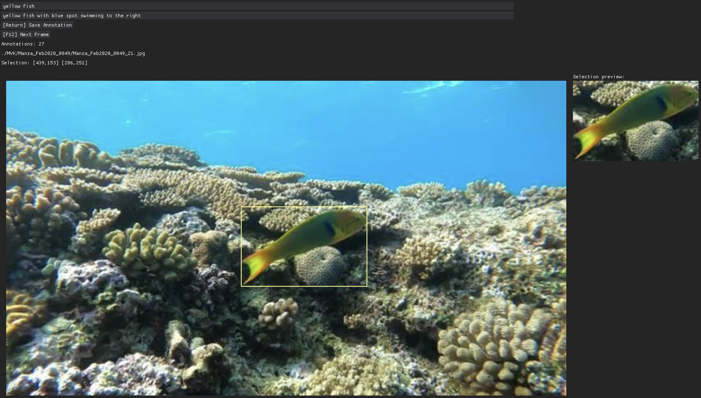

The user study was conducted in two iterations. Initially, only the annotator that allowed skipping frames was presented to the users. However, it was later reasoned that allowing users to skip frames could lead to biases that would be difficult to mitigate, such as a lack of annotations for hard-to-describe objects (e.g., frames containing only rocks). Therefore, the second annotator was created and distributed to the users.

In total, 12 users participated in the study. Half of these users had prior experience with localization research, and the other half had no knowledge of the field. 741 unique annotations were collected; 486 were obtained with the annotator that allowed users to skip frames (skippable annotations), and the remaining 255 were obtained with the annotator that required users to annotate at least one object per frame (non-skippable annotations).

The graph below depicts how many annotations were provided per user.

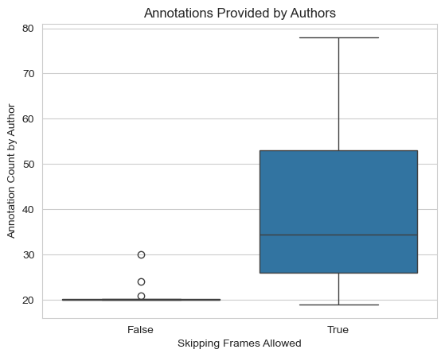

Although the instructions asked users to provide exactly 20 non-skippable annotations, a few users provided more. It was decided that having extra data was more valuable than enforcing consistency, and thus all non-skippable annotations were kept.

Users were asked to provide two textual descriptions for each annotation, which differed in length. The annotators showed text hints in the respective description text boxes that indicated how long each description should be: the shorter one was *short description* (17 characters long), and the longer one was *a longer and more detailed description of the selected object* (61 characters, 10 words). However, the actual length was not enforced for the following two reasons:

- Although the MVK dataset contains videos from a single domain, there is a rich variety of objects that users could annotate. Some objects, usually animals, are much easier to describe than monotonous objects, like rocks. Forcing a user to write a long description about such monotonous objects could result in descriptions composed primarily of filler words that have close to no weight in search algorithms.
- During the pre-study, where a rougher but still similar annotator was used, it was quickly noted that users tended to become frustrated when asked to provide longer descriptions, especially for monotonous objects. It was reasonable to assume that such disgruntled users would be less likely to provide more annotations than needed; thus, user experience was prioritized.

The following graphs display the lengths of user descriptions in characters and words, respectively. Although the descriptions are shorter than the text hints on average, this was not considered an issue. The main reason for requiring two descriptions was to analyze whether longer descriptions improve performance, and not to study their exact relationship.

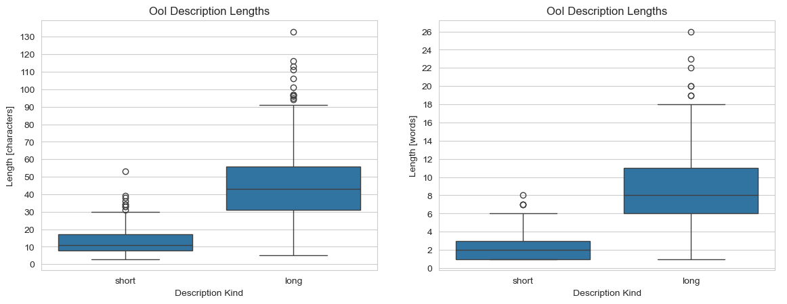


Finally, the graph below shows the distribution of annotation bounding boxes. Although the density slightly differs for the skippable and non-skippable annotations, it is not considered significant.

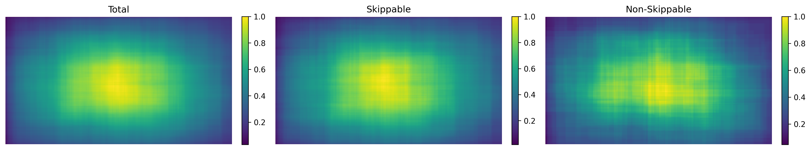

# Baseline Analysis

This section analyzes non-localized similarity search, which will serve as a baseline for comparison with other search methodologies.


## Evaluation

First, it is essential to understand the evaluation process, depicted in the figure below:

1.  The evaluation algorithm ingests the MVK dataset and a single annotation (in the figure, a user annotated the shark on the protruding frame).
2.  Similarity search is conducted using the annotation description, yielding a list of frame indices sorted by similarity.
3.  The rank (position) of the annotated frame in the list is identified and used as the final score for this annotation (note that each annotation yields two scores: one for the short description and one for the long one).

This evaluation approach simulates the performance of real video search engines. In such search engines, the user provides a textual query and is presented with a sorted list of frames most similar to it. The search performance is measured by how long the user has to scroll to find the target frame, which is analogous to finding the rank of the target (annotation) frame in the sorted list.

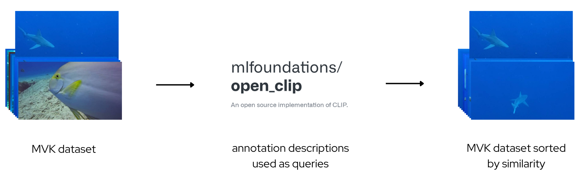


## Results

The results will be presented as cumulative graphs with the rank threshold as the x-axis and the percentage of annotations that met this threshold as the y-axis. If *n* is the number of frames extracted from the MVK dataset, then the x-axis ranges from 0 to *n*. All graphs will clarify what source data was used for their construction, namely:

- Whether the graph was made with skippable or non-skippable annotations (no graph contains both kinds due to different biases).
- What CLIP text-to-image model was used (either the model used by PraK in VBS 2024 or 2025).
- Whether short or long annotation descriptions were used as queries.
- Whether the annotation bounding boxes were artificially perturbed (this technique will be detailed later).

The graphs below compare the different models and description lengths; the second graph has its x-axis limited to a rank of 100. Although both graphs contain the same data, the first graph shows that, most of the time, the 2025 model dominates the 2024 model, whereas the cropped graph shows that long descriptions dominate short ones at the beginning of the cumulative function.

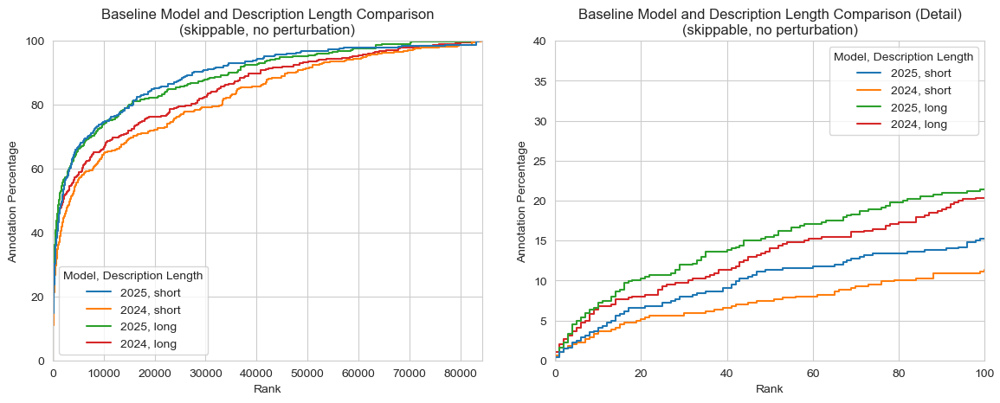

A hypothesis was made that this is due to query quality. If the target frame (object) can be uniquely described with a textual query, it will rank at the top even when using weaker models. Otherwise, the frame will rank somewhere among all other frames for which the query holds, in which case the stronger models prune false positives more effectively. This claim is supported by the following graphs made from non-skippable annotations. Notice the difference in the uncropped graph: the long queries using the 2024 model dominate the short queries of the 2025 model much longer than in the case of skippable frames. Because non-skippable annotations contain harder-to-describe objects, short descriptions like *two rocks* and *coral* are much more common. In these cases, the stronger model struggles to filter out false positives, whereas long queries contain more discernible information that leads to better ranks.

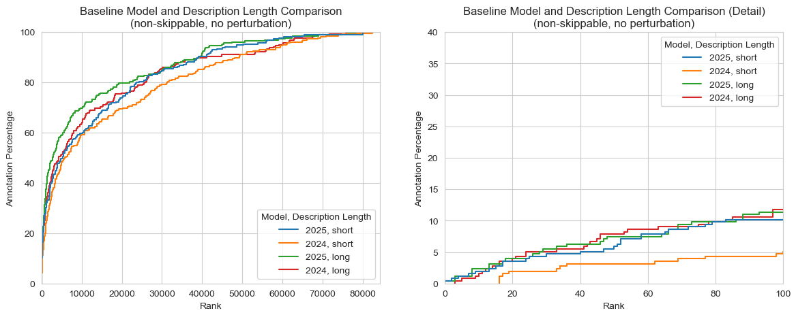

Because this study aims to analyze similarity search methodologies for the purpose of finding good candidates for actual implementation in a video search engine, only a short prefix of the returned lists sorted by similarity will be considered. The top-ranking search results are the most relevant; a video search engine user would not scroll through all 84,000 returned frames. Due to this, all following graphs will be bound to a maximum rank of 100. Subsequently, the y-axis will be bound to 40% so that all presented graphs are easily comparable.

# Static Grid and Textual Analysis

This section details how the static grid analysis was conducted, discusses its results, and compares them to the baseline. Additionally, textual localization will be analyzed, as it is in many ways similar to a static grid.

## Evaluation

The evaluation of the static grid is mostly identical to the baseline evaluation, as shown in the diagram below. Alongside the dataset and annotation, a specific grid is provided. Before the similarity search is conducted, the intersection-over-union (IoU) is computed for each grid segment with the annotation rectangle, and the segment with the highest IoU is selected. The MVK dataset is then cropped to the dimensions of the selected segment. Similarity search then uses the cropped MVK dataset to find the rank of the annotated frame.

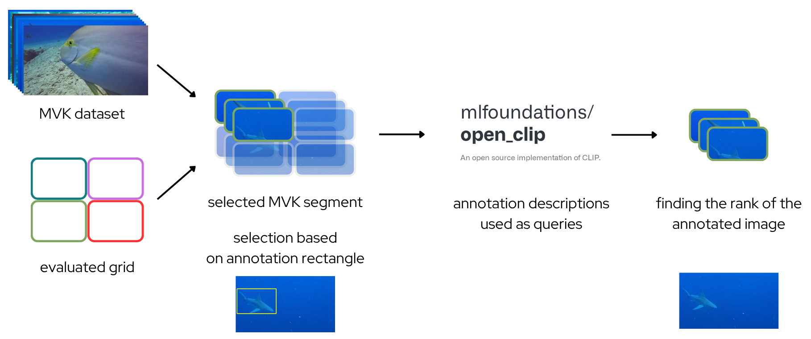

Note that this evaluation approach is comparable to the one used for the baseline. No frames were omitted during similarity search; they were only cropped to a specific region. This approach will also be applied in the dynamic and theoretical analysis, but a different cropping function will be used.

The evaluation process for textual localization is based on the one used for the static grid. An input grid is provided and IoU is computed; however, instead of cropping the MVK frames, the selected grid segment will be represented with a textual suffix that will be appended to the query.

## Grids

Two types of grids were evaluated: the 5-grid and the 9-grid, as seen in the diagram below.

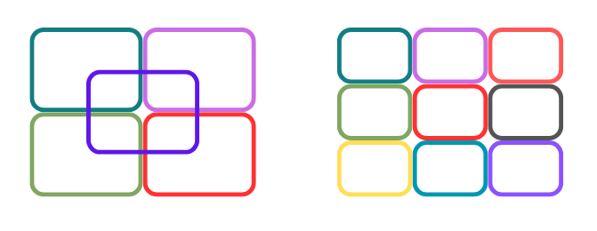

Additional grids with overlapping segments were defined for both to test whether they performed better than the base grids. An example 4-grid with its overlapping version is depicted below. The 4-grid was chosen for simplicity of presentation; it is not evaluated in this study.

The overlap is measured in percentages relative to the frame sides. An overlap of 10% means that each grid segment had its sides prolonged by 10% of the entire frame's sides, not the segment's sides.

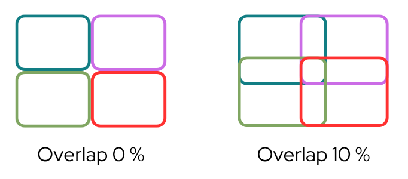

The following overlaps were measured for the 5- and 9-grids:

- **5-grid**: 0%, 10%, 20%, 30%, and 40%
- **9-grid**: 0%, 5%, 10%, 15%, 20%, 25%, and 40%.

## Results

The graphs below compare the best-performing 5- and 9-grid with the baseline and textual localization. The 5-grid was chosen for textual localization, as it still produces reasonably simple suffixes, such as *in the upper left part of the image* or *in the center part of the image*.

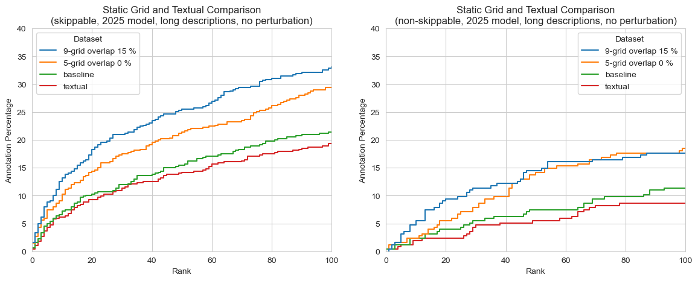

Both graphs show similar trends, with the second showing significantly worse performance because non-skippable annotations were used. Also note that there are almost twice as many skippable annotations, resulting in less variance in the first graph.

Using the 9-grid over the baseline resulted in about 66% more annotations ranking in the first 100 results, which is a surprisingly high performance increase. Another surprising result is that textual localization performed worse than the baseline, implying that modern text-to-image models are not strong enough to handle localization on their own.

## Perturbation Results

The graphs above used the perfect, user-drawn annotation bounding boxes to select a grid segment. However, in a real system, where the user has to draw a bounding box without seeing the image they are trying to find, errors are introduced. This study attempts to measure the performance decrease with artificial perturbations applied to annotation bounding boxes.

The perturbations were simulated with Gaussian noise applied in the form of shifts (moving the bounding box) and deformations (changing the width and height). Both errors are defined with a single parameter, the *perturbation factor*. An example perturbation of 0.1 would be translated into the following errors:

- **Shift**: The Gaussian distribution with a mean of 0 and a standard deviation of 10 (100 times the perturbation factor) will be sampled twice and applied to the vertical and horizontal position of the bounding box.
- **Deformation**: The Gaussian distribution with a mean of 1 and a standard deviation of 0.1 (the perturbation factor) will be sampled twice and multiplied with the width and height of the bounding box.

For each pair of annotation and perturbation factor, five different bounding boxes were produced to reduce the variation of the results. The following heatmaps depict the effects of perturbation for the different grid overlap factors and display how many annotations ranked at the top 100 as the recall percentage (effectively the values shown on cumulative graphs at rank 100). Note that the color scale differs for skippable and non-skippable annotations.

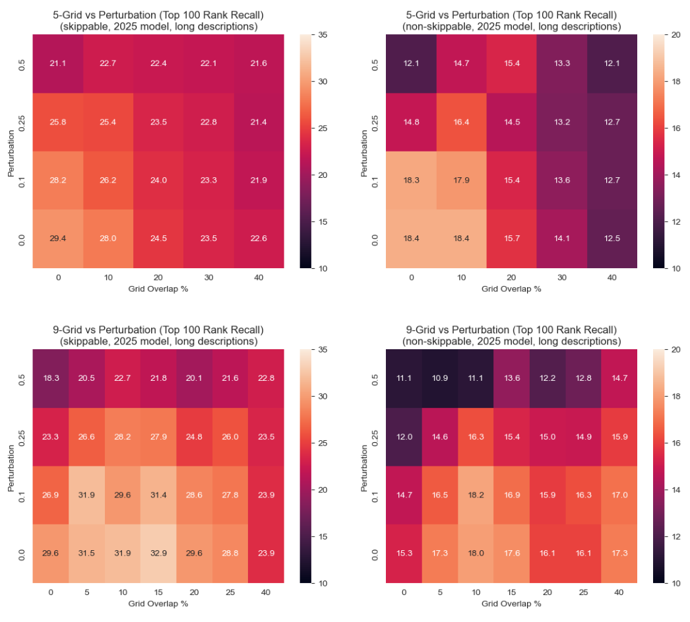

The general trend of the graphs is that perturbation decreases the relative performance of grids with smaller overlaps more. This could be interpreted as grids with bigger overlaps being more robust; more bounding boxes tend to fall into the correct segments.

The takeaway from these graphs is that systems implementing grid search should consider using higher overlaps in case their users tend to draw bounding boxes with significant perturbation. An interesting approach would be to dynamically measure the perturbation for each user and employ a grid that best matches their needs on an individual basis.

# Dynamic Analysis

Instead of using a static grid to partition frames, an object detector could locate Objects of Interest (OoI) within the dataset and define a custom grid for each frame. This approach offers the significant advantage that each frame can have a different number of segments based on how many OoIs they contain. Additionally, segment sizes are derived from the OoIs, potentially removing much more visual clutter than static grids.

However, this comes with the significant downside of relying on the object detector to identify relevant objects. Its parameters will need to be fine-tuned to reduce the number of false positives and false negatives, and there is always the possibility that the user will search for an object the detector is not trained on.

This study will use the Grounding DINO [5] object detector, primarily for its zero-shot detection functionality, which does not rely on a predefined list of classes that can be detected.

## Evaluation

The evaluation process uses the same principles as the static grid evaluation. However, instead of selecting a single segment for the entire dataset based on its IoU with the annotation bounding box, the segments are selected on a per-frame basis.

Because there is no guarantee that a segment with a positive IoU will always exist (the object detector might fail to detect anything on a frame), a fallback mechanism will be introduced. Each frame grid will be appended with a segment spanning the entire frame. This ensures that every bounding box will have a positive IoU with at least the fallback segment. Additionally, due to the size of the fallback segment, its IoU with the bounding box will tend to be small, meaning other segments with significant intersection will be preferred.

## Results

The following graphs compare the dynamic approach with the best-performing static grids and the baseline. Although the same dynamic partitioning was used for both graphs, the first graph shows that the dynamic approach performs about the same as the 5-grid. In contrast, the second graph, which uses non-skippable annotations, shows that it starts to fall behind. This is most likely due to the fact that non-skippable annotations contain objects with much lower objectness, such as rocks and corals, which the object detector filtered out.

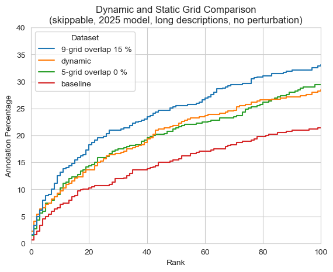

Additionally, the number of times each similarity search had to use the fallback segment for a given frame was tracked, indicating no detection was made by the object detector at the position of the annotation bounding box. For skippable frames, the fallback segment was used 27.1% of the time, while for non-skippable ones, it was used 25.4% of the time. Note that this statistic only depends on the dynamic partitioning and the distribution of the annotation bounding boxes, which is similar for both skippable and non-skippable annotations.

# Theoretical Analysis

Finally, the theoretical analysis aims to find the upper performance bound when using grid-based localization. Instead of using a static grid for all frames or a different grid for each frame, it utilizes a different grid for each similarity search. When the user provides the bounding box for the query, the entire dataset is cropped to that box, ensuring an optimal IoU of 100% for all frames.

The reason this approach is considered only theoretical is because it is extremely computationally intensive. In the static grid and dynamic approaches, the grid segment embeddings could be precomputed. However, due to the user-provided bounding box being arbitrary, it is impossible to precompute the embeddings. Even a performant NVIDIA H100 takes around 20 minutes to compute the required embeddings for the MVK dataset, making the system unusable for real-time applications.

## Evaluation

The evaluation process is effectively the baseline evaluation with a different input dataset. This dataset is produced by cropping the MVK dataset to the annotation bounding box, as illustrated in the diagram below.

The leftmost column represents the frame the user annotated. Note that out of the four shark images, only the annotated one remains whole, while two sharks get cropped out entirely. Whereas the dynamic approach would produce a segment where the shark in the third column would remain whole, this approach crops a significant portion of it away, lowering its final ranking.

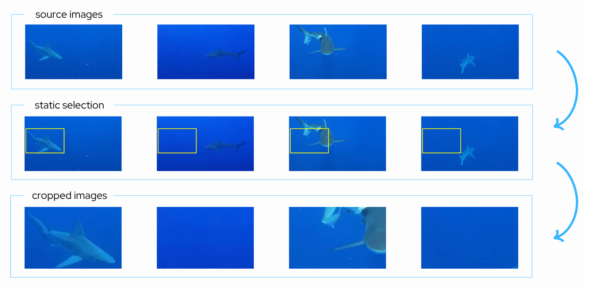

## Results

Over the course of several months, the results for the theoretical analysis were computed. The following graphs compare all methods analyzed in this study.

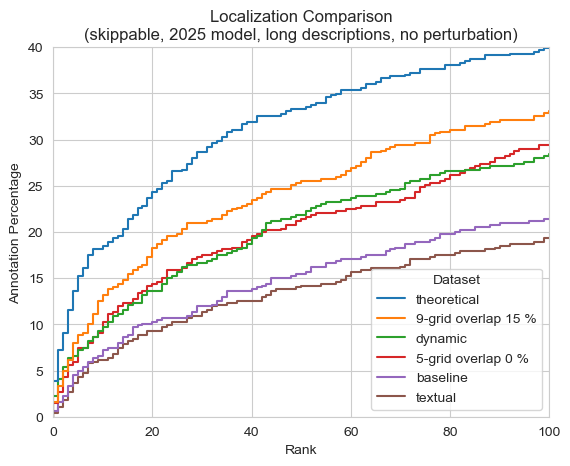

The theoretical approach ranks significantly higher than the others; almost two times better than the baseline for skippable annotations, and over two and a half times better for non-skippable annotations. Notably, the 9-grid is closer to the theoretical approach than the baseline for skippable frames, although it should be noted that no perturbations were considered in these graphs.

Finally, the last experiment was to test whether enlarging the annotation bounding box improved performance of the theoretical approach, i.e., whether adding some neighboring visual context helps. The following graph shows that it actually significantly harms the performance.

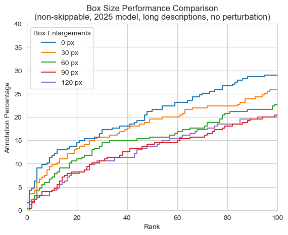

In this graph, box enlargement refers to how many pixels the annotation bounding box was stretched in all four directions. For reference, all MVK frames have a resolution of 682x384.
Due to how long the computation takes, a similar graph for skippable annotations was not produced.

# Publications and Results

This study found that sub-image search methodologies can significantly improve search performance, and it contextualized these findings with a theoretical upper bound.

The 9-grid emerged as a more performant alternative to whole-image search. It is simple to implement and remains reasonably user-friendly, requiring users to either specify a segment or draw a bounding box using an interface element.

Although the dynamic approach performed worse, its effectiveness is directly tied to the object detector used. This suggests that further fine-tuning or the use of more advanced models could significantly boost its performance.

A surprising finding was the reduced performance of textual queries, implying that explicitly specifying the locality of searched objects might actually cause more harm than benefit.


Finally, this study laid the groundwork for two papers currently being submitted to the SISAP 2025 conference. The first paper [6] summarizes the improvements achieved by using static grids and details the data collection process. The second paper [7] focuses on the dynamic approach and compares it to the results obtained from the theoretical analysis.

# Project Structure and Usage

This section will detail the design of the software, go over the installation and configuration process, and describe how it is used.


## Architecture and Design

This project is structured as a collection of scripts, reflecting the diverse nature of its computations. The general workflow is divided into a long precomputation phase, where necessary embeddings and detection rectangles are generated, and a shorter evaluation phase, which produces CSV datasets for analysis.

The project comprises the following components, which are also depicted in the diagram below:

- **Annotation GUI**: These are the two annotators utilized by users to produce annotations. Aside from the MVK dataset, annotations are the sole source of raw data ingested by the system; all other data is derived from the dataset and annotations.

- **Configuration Provider**: This component parses the system configuration and provides it to other components. Notably, the configuration dictates which embeddings and evaluations will be computed and defines the database's structural layout.

- **Database**: A file storage system organized into folders containing annotations, MVK frames, computed embeddings, detections, and evaluation results. Given that it exclusively contains files that do not necessitate sophisticated querying, it was determined that BLOB or JSON databases would merely complicate the system without adding substantial value.

- **Database Gateway**: An interface component for the database. It also provides the two CLIP models, thereby abstracting low-level details from the analysis tools.

- **Analysis Tools**: A collection of libraries implementing methods for computing embeddings and evaluating results. The primary libraries include the *static*, *dynamic*, and *theoretical* analysis tools for distinct localization methods, and the *GroundingDINO detector*, which acts as an interface for the GroundingDINO package.

- **Preprocessing Tools**: These are simple scripts that typically invoke a single method from the analysis tools to generate detections and embeddings. Historically, these scripts were executed in various environments, such as standard PC setups or GPU computation clusters, and are thus designed for ease of modification.

- **Dataset Creation Tool**: This tool invokes the evaluation methods implemented by the analysis tools to produce CSV datasets, which are subsequently processed and used to generate graphs.

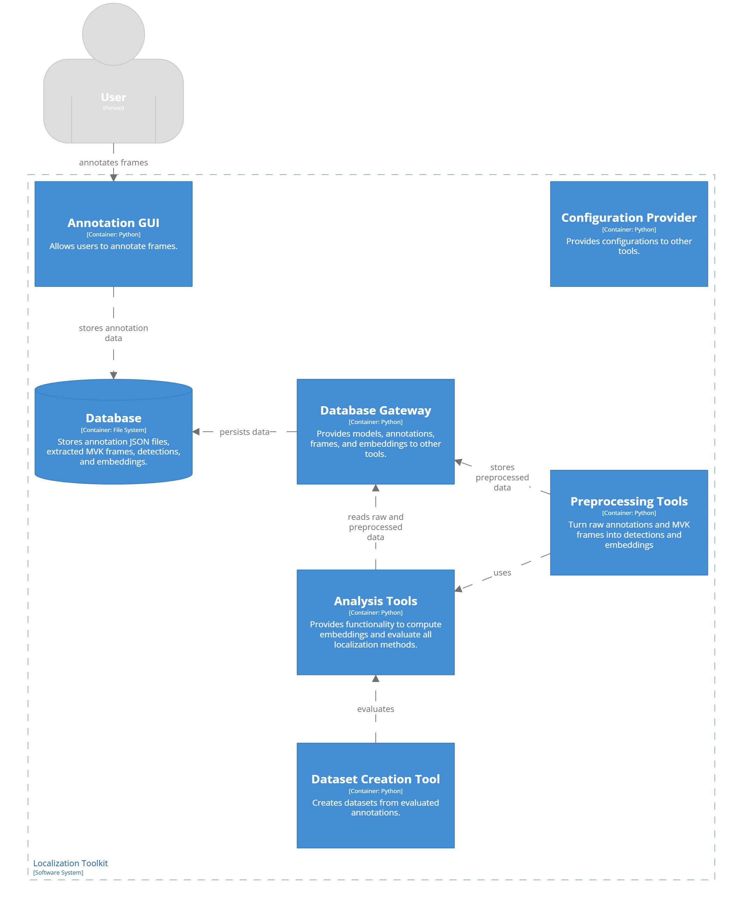


### Important Modules and Classes:

- **rectangles**: This module contains functions for manipulating rectangles, typically annotation or detection bounding boxes. It expects rectangles in the *[x1, y1, x2, y2]* format and can perform operations such as computing IoU with another rectangle, perturbing the rectangle, and confining the rectangle to a specific area (useful for perturbed rectangles that shift outside the frame).

- **boundaries**: This module defines grid segment boundaries as a list of rectangles; most notably, it defines the 5- and 9-grids with arbitrary overlaps. It also contains a function that can partition images with a given boundary function, which is utilized by the static analysis tool.

- **TheoreticalJobScheduler**: This class is employed by the theoretical preprocessing tool to schedule and compute embeddings. As theoretical embeddings require several months to compute, it was necessary to offload this computation to a GPU cluster. To prevent computation nodes from processing the same annotations, a scheduler was developed that assigns each node a unique collection of jobs. The scheduler is resilient to delayed node execution, meaning that even if a given node starts days later, no conflicts will arise. Furthermore, it does not necessitate communication between nodes to schedule jobs fairly; it relies on a trick that if the user schedules a different prime number of nodes each time, the jobs will be distributed evenly.

- **Analysis Tools**: Although these modules differ in their content, they have the same underlying structure.
They each define a function used by the preprocessing tools to compute embeddings, and a separate function that the dataset creation tool uses for evaluation.
The evaluation functions are named `*get_file_results* and operate on annotation files and, notably, define what columns the datasets will contain.

## Installation

It is recommended to install the packages and run the scripts from a virtual environment.
All of the scripts were tested on Python3.11, although they might work for different versions as well.

```bash
python3 -m venv venv
source venv/bin/activate
python3 -m pip install -r requirements.txt
mkdir models
```

You then need to download the *ViT-SO400M-14-SigLIP-384* model checkpoint from [here](https://github.com/Visual-Computing/MCIP?tab=readme-ov-file#model-checkpoints) and place it in the *models* folder.

The dynamic analysis requires the Grounding DINO package, which is installed directly from the Grounding DINO repository found [here](https://github.com/IDEA-Research/GroundingDINO).
Make sure to follow all the installation instructions.

The scripts require a folder with MVK frames and annotations that are not part of this repository.
Please contact the maintainer for the data.
The paths to these folders can be configured in `config.json` under the `datasetPath` and `annotationsDir` keys.
By default, the *MVK* and *annotations* folders are expected to be placed in the parent directory containing the cloned repository.

## Configuration

To configure the scripts, you can edit values in the `config.json` file.

The most impactful configuration is found under the *embedConfigs* keys, which dictates which embeddings will be computed and evaluated.
This key can be found in the *derivedDatasetEmbeddings* (theoretical analysis), *staticEmbeddings* (static grid analysis) and *dynamicEmbeddings* (dynamic analysis) sections of the configuration.
In is structured as a list of objects with the following keys:
- *skippable*: What annotations should be used (skippable, non-skippable).
- *model_year*: What text-to-image model should be used.
- *box_enlargements*: For the theoretical analysis, how much should the annotation bounding box be enlarged.
- *kind*: For the static grid analysis, what grids should be used.
- *perturbation_factor*: For the static grid analysis, what perturbation should be applied to the annotation bounding boxes.

The rest of the configuration is mostly paths that do not need to be changed and metadata like frame dimensions.

## Scripts

The following scripts either create embeddings for the analysis, or produce a dataset from these embeddings.

- `datasetCreator.py`: Creates CSV datasets inside the `results` folder (will be created if absent) from the computed embeddings.
Contains a function for each dataset type (annotation, static analysis, dynamic analysis, theoretical analysis).

- `computeTheoreticalEmbeddings.py`: Creates embedding files from annotations. This is a very computationally intensive task; a single annotation file can take several hours to process. Because of this, it is intended to be run on multiple nodes. It takes two arguments: the 0-based serial number of the node and the total number of nodes running the script. Each node will be assigned a subset of annotations. The script guarantees that two nodes will not work on the same annotations, provided they have different serial numbers and the same total number of nodes in their launch parameters. This holds true even if the nodes start running at different times. We recommend using prime numbers for the total number of nodes and changing this number to a different prime with every batch to balance the workload (think of a "node" here more as a job submission rather than a physical machine).

- `computeStaticEmbeddings.py`: Creates static grid embedding files.
The function call inside the file can be used with different parameters.
Use either "2024" or "2025" for the model year and "whole" or "centerpiece_overlap" for the segmentation kind followed with the desired overlap percentage.

- `computeDetectionRects.py`: Uses the Grounding DINO object detector to find objects in frames.
Yields a file with bounding boxes.

- `computeDynamicEmbeddings.py`: Ingests the bounding box file computed in `computeDetectionRects.py` and calculates embeddings for all grid segments.

The scripts inside the `annotators` folder are the annotation tools used for the study.

The `lib` folder contains various function collections used by the previously mentioned scripts:

- `databaseGateway.py`: Provides an interface with the file database and provides models.
- The various `analysisTools`: Contain the implementations for how the embeddings are created and datasets derived.
- `boundaries.py`: Contains definitions for various grid segments used by the static grid and textual analysis.
- `rectangles.py`: Contains several utility functions for rectangle manipulation, such as IoU computation and rectangle perturbation.
- `groundingDinoDetector.py`: A modified Grounding DINO demo script that computes detection bounding boxes.

Finally, the `graphs.ipynb` Jupyter Notebook ingests the produced CSV datasets to produce the various graphs found in this study.

## Usage

The scripts placed directly in the main repository folder can be run as-is.
Make sure you run them from that folder so that the relative paths in `config.json` hold.

# References
[1] Stroh, Michael; Kloda, Vojtěch; Verner, Benjamin; et al. PraK Tool V3: Enhancing Video Item Search Using Localized Text and Texture Queries. In: Ide, Ichiro; Kompatsiaris, Ioannis; Xu, Changsheng; Yanai, Keiji; Chu, Wei-Ta; Nitta, Naoko; Riegler, Michael; Yamasaki, Toshihiko (eds.). MultiMedia Modeling. Singapore: Springer Nature Singapore, 2025, pp. 326–333. isbn 978-981-96-2074-6.

[2] Truong, Quang-Trung; Vu, Tuan-Anh; Ha, Tan-Sang; Jakub, Lokoc; Tim, Yue Him Wong; Joneja, Ajay; Yeung, Sai-Kit. Marine Video Kit: A New Marine Video Dataset for Content-based Analysis and Retrieval. 2022. Available from arXiv: 2209.11518 [cs.CV].

[3] laion/CLIP-ViT-H-14-laion2B-s32B-b79K. Available also from: https://https://huggingface.co/laion/CLIP-ViT-H-14-laion2B-s32B-b79K

[4] Retrieval Optimized CLIP Models. Available also from: https://github.com/Visual-Computing/MCIP

[5] Liu, Shilong; Zeng, Zhaoyang; Ren, Tianhe; Li, Feng; Zhang, Hao; Yang, Jie; Li, Chunyuan; Yang, Jianwei; Su, Hang; Zhu, Jun, et al. Grounding dino: Marrying dino with grounded pre-training for open-set object detection. arXiv preprint arXiv:2303.05499. 2023

[6] Jäckl, Bastian; Kloda, Vojtěch; Keim, Daniel A.; Lokoč, Jakub; Experimental evaluation of static image sub-region based search models using CLIP. Submitted to SISAP 2025.

[7] Jäckl, Bastian; Kloda, Vojtěch; Keim, Daniel A.; Lokoč, Jakub; Dynamic Sub-region Search in Homogeneous Collections Using CLIP. Submitted to SISAP 2025.
