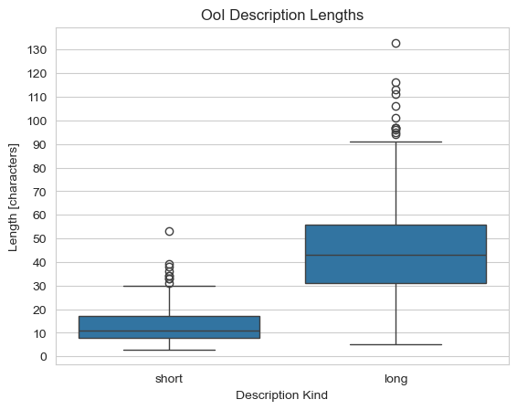
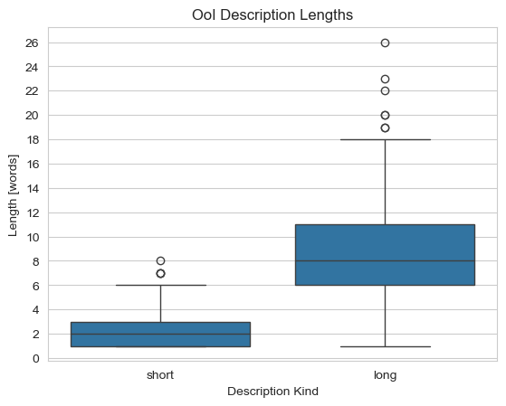
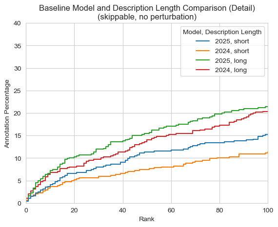
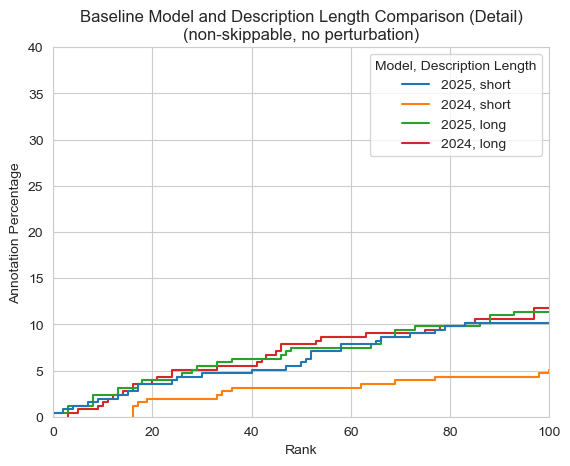
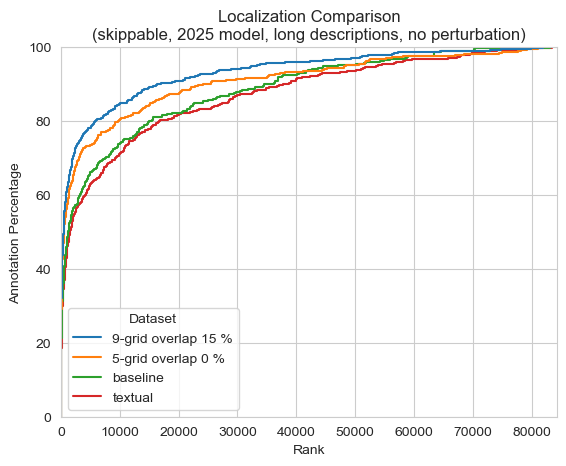

# Localization Research Project

This repository contains the documentation, results, and code used in the scope of the research project "The influence of localization on video search engine performance".
The goal of this project was to implement a set of tools used to analyze the performance of sub-image search for video search engines utilizing text-to-image similarity models.
Several tools were devised, but generally all tools are computationally intensive and were run for several months on a server dedicated to GPU computation.
The detailed specification of this project can be found here TODO.

# Introduction

CLIP-based text-to-image models form the backbone of modern video search engines.
They allow users to prompt vast video databases with textual queries, yielding accurate results.
However, it is not always possible to formulate effective text queries when searching in video domains requiring expert knowledge.
Competitions like the Video Browser Showdown (VBS) demonstrate this challenge by requiring competitors to search in datasets of medical or marine footage, fueling the development of search techniques that do not rely on text alone.

This study was conducted due to the promising results shown in its pre-study, which focused on sub-image search using a static grid.
Instead of writing prompts for the whole image, grid-based sub-image search allows to specify what part of the image should be searched, removing visual context that is not needed for the query.
Because of the pre-study, an existing video search system called PraK was extended with grid-search functionality, which was subsequently used in the 2025 round of VBS.
The pre-study was summarized in the paper detailing the system TODO:cite.

This study conducts a more rigorous investigation into how various sub-image search methodologies perform.
To be able to compare them, a study was held which tasked attendees of various backgrounds to annotate random frames from the Marine Video Kit (MVK) dataset TODO:cite.
The collected data served to simulate users using a real video search engine with a simple performance metric that can be measured for all sub-image search methodologies analyzed in this study.
These were, in no particular order, textual localization, grid-based localization, localization based on object detectors, and a theoretically optimal static localization method that served as the upper performance ceiling.

Two CLIP text-to-image were evaluated in this study, namely the TODO:find out, used by the PraK system in the 2024 round of VBS and TODO:find out, used in VBS 2025.

# Used Terms

- **Similarity**: A scalar value obtained by computing cosine-similarity on two normalized feature vectors (embeddings).
Higher similarity means that two vectors tend to be more proportional, and thus more likely to be embeddings of similar concepts, whereas lower similarity implies that the vectors are unrelated.
Although different similarity measurements exist, this study uses only cosine-similarity due to its effectiveness and widespread use in the field of video search.
- **Similarity search**: A technique that ranks a set of embeddings based on their similarity with the query embedding.
In video search, this usually takes the form of ranking the individual video frame embeddings based on their similarity to the embedding of a textual user query.
The result of similarity search is a list of frame indices ranked from the most to least similar to the query.
- **Sub-image search**: A specialization of similarity search that utilizes parts of an image instead of the whole image.
- **Grid**, **grid segments**, **grid-search**: A grid is a static partitioning used for all frames of a video dataset.
The partitions are referred to as grid segments, and grid-search is a realization of sub-image search where frames cropped to a selected grid segment are compared with the query.
Traditional whole-image search can be seen as grid-search using a single grid segment of the size of the whole image.
- **Textual localization**: Textual localization is the technique of explicitly adding spatial information into the textual user query.
An example user query without textual localization could be: *A yellow fish*; and with textual localization: *A yellow fish in the upper left corner of the image*.
- **Annotations**: Data collected during the user study.
Each annotation is a composed by an identifier of the annotated frame, a short and long textual description of the annotated object, and the location and dimensions of a bounding box drawn around the object.
In case the annotation was collected with the annotator allowing the user to skip frames, it is referred to as a **skippable** annotation, otherwise it is known as an **non-skippable** annotation.
- **Perturbation**: In this study, perturbation refers to spatial errors in drawn annotation bounding boxes.
While the users annotating frames for this study could draw perfect bounding boxes around objects of interest (OoI), a user operating a video search engine that would allow to specify in what region of the frames the object should be could not draw with such precision.
Such imperfect bounding boxes are considered perturbed.

# User Study

The aim of the user study was to collect MVK annotations with information regarding the locality of annotated objects.
All users were presented with two distinct annotation programs (annotators), the MVK dataset, and textual instructions, which can be found [here](./annotators/INSTRUCTIONS.txt).


Both annotators present the same user interface; their only difference is whether users are allowed to skip frames without annotating any object on them.
The following image is a screenshot of one of the annotators.
The centerpoint of the user interface is a random frame selected from MVK.
By dragging their mouse on the frame, users can draw yellow rectangles to specify what object is being annotated.
This is followed by the annotator presenting the cropped object on the right of the screen, allowing users to double check their annotation.
On the top are two text boxes that the users had to fill out with the short and long descriptions of the object.
Once both the text boxes were filled and a rectangle drawn, the annotation could be submitted.
The user could then either go to the next frame, or annotate another object on the same frame.


The user study was conducted in two iterations.
Initially, only the annotator that allowed skipping frames was presented to the users, but it was later reasoned that allowing users to skip frames would lead to biases that could not be easily mitigated, such as a lack of annotations of hard to describe objects (i.e., frames containing only rocks).
Therefore, the second annotator was made and distributed to the users alongside new instructions, which had the sole addition of the paragraph detailing the second annotator (TODO: fact check whether it is a single paragraph).

In total, 12 users partook in the study, half of which had prior experience with localization research, and the other half had no knowledge of the field.
741 unique annotations were collected, 486 of which were obtained with the annotator that allowed to skip frames (skippable annotations), and the remaining 255 were obtained with the annotator that forced the users to annotate at least one object per frame (non-skippable annotations).

The graph below depicts how many annotations were provided per user.


Although the instructions asked the users to provide exactly 20 non-skippable annotations, a few users provided more.
It was decided that having extra data is more valuable than to enforce consistency, and thus all non-skippable annotations were kept.

Users were asked to provide two textual descriptions for each annotations which different in their lengths.
The annotators showed text hints in the respective description text boxes that indicated how long each description should be, with the shorter one being *short description* (17 characters long), and the longer one *a longer and more detailed description of the selected object* (61 characters, 10 words).
However, because of the following two reasons, the actual length was not enforced.
- Although the MVK dataset contains videos from a single domain, there is a rich variety of objects that users could annotate.
Some objects, usually animals, are much easier to describe than monotonous objects, like rocks.
Forcing a user to write a long description about such monotonous objects could result in descriptions composed primarily of filler words that have close to no weight in search algorithms.
- During the pre-study, where a rougher but still similar annotator was used, it was quickly noted that users tend to become frustrated when asked to provide longer descriptions, especially for monotonous objects.
It would be reasonable to assume that such disgruntled users are less likely to provide more annotations than needed, thus user experience was prioritized.

The following graphs display the lengths of user descriptions in characters and words, respectively.
Although the descriptions are shorter than the text hints on average, this was not considered an issue.
The main reason for requiring two descriptions was to analyze whether longer descriptions improve performance, and not to study their exact relationship.




# Baseline Analysis

This section will analyze non-localized similarity search, which will serve as a baseline for comparison with the other search methodologies.

## Evaluation

First, it is essential to understand the evaluation process, which is depicted on the figure below.
1. The evaluation algorithm ingests the MVK dataset and a single annotation (in the figure, a user annotated the shark on the protruding frame).
2. Similarity search is conducted with the annotation description, yielding a list of frame indices sorted by similarity.
3. The rank (position) of the annotated frame in the list is identified and used as the final score for this annotation (note that each annotation yields two scores, one for the short description and one for the long one).

This evaluation approach simulates the performance of real video search engines.
In such search engines, the user provides a textual query and is presented with a sorted list of frames most similar to it.
The performance of the search is measured by how long the user has to scroll to find the target frame, analogous to finding the rank of the target (annotation) frame in the sorted list.


This evaluation approach is used for the other search methodologies as well.

## Results

The results will be presented as cumulative graphs with the rank threshold as the x-axis and the percentage of annotations that met this threshold as the y-axis.
If *n* is the number of frames extracted from the MVK dataset, then the x-axis ranges from 0 to *n*.
All graphs will clarify what source data was used for their construction, namely:
- Whether the graph was made with skippable or non-skippable annotations (no graph contains both kinds due to different biases).
- What CLIP text-to-image model was used (either the model used by PraK in year 2025 or 2024 for the VBS competition).
- Whether short of long annotation descriptions were used as queries.
- Whether the annotation bounding boxes were artificially perturbed (this technique will be detailed later).

The graphs below compare the different models and description lengths; the second graph has its x-axis limited to the rank of 100.
Although both graphs contain the same data, the first graph shows that, most of the time, the 2025 model dominates the 2024 model, whereas the cropped graph shows that long descriptions dominate short ones at the beginning of the cumulative function.




A hypothesis was made that this is due to how good queries are.
If the target frame (object) can be uniquely described with a textual query, it will rank at the top no matter how good the underlying model is.
Otherwise, the frame will rank somewhere among all other frames for which the query holds, in which case the stronger models prune false positives more effectively.
This claim is supported by the following graphs made from non-skippable annotations.
Notice the difference in the uncropped graph; the long queries using the 2024 model dominate the short queries of the 2025 model much longer than in the case of skippable frame.
Because non-skippable annotations annotate much harder to describe objects, short queries like *two rocks* and *coral* are much more common, and stronger model struggles to filter out false positives TODO:continue here  do not hold enough information to 





Because this study aims to analyze similarity search methodologies for the purpose of finding good candidates for actual implementation in a video search engine, only a short prefix of the returned lists sorted by similarity will be considered.
The top ranking search results are the most relevant; a video search engine user would not scroll through all 84 thousand returned frames.
TODO: cite lokoc study
Due to this, all following graphs will be bounded to the maximum rank of 100.
Subsequently, the y-axis will be bound to 40 % so that all presented graphs are easily comparable. 

# Static Grid Analysis

This section will detail how the static grid analysis was conducted, discuss its results, and compare them to non-localized similarity search (a baseline for all comparisons), as well as similarity search using textual localization.

## Evaluation

First, it is essential to understand the evaluation process, which is depicted on the figure below.
1. The evaluation algorithm ingests the MVK dataset, a grid that is being evaluated, and a specific annotation (the picture with a shark on the figure).
2. Intersection-over-union (IoU) is computed for each grid segment with the annotation rectangle, and the segment with the highest IoU is selected.
3. The MVK dataset is cropped to the dimensions of the selected segment and a similarity search is conducted with the annotation description, yielding a list of frame indices sorted by similarity.
4. The rank (position) of the annotated frame in the list is identified and used as the final score for this annotation (note that each annotation yields two scores, one for the short description and one for the long one).

This evaluation approach simulates the performance of real video search engines.
In such search engines, the user provides a textual query and is presented with a sorted list of frames most similar to it.
The performance of the search is measured by how long the user has to scroll to find the target frame, analogous to finding the rank of the target (annotation) frame in the sorted list.


This evaluation approach is used for the other localization methods as well; they differ only in how they produce the set of frames used in the similarity search.

## Grids

Two types of grids were evaluated; the 5-grid and 9-grid, as seen on the diagram below.


Additional grids with overlapping segments were defined for both grids to test whether they performed better than the base grids.
An example 4-grid with its overlapping version is depicted below.
The 4-grid was chosen for simplicity of presentation; it is not evaluated in this study.

The overlap is measured in percentages relative to the frame sides.
An overlap of 10 % means that each grid segment had its sides prolonged by 10 % of the sides of the whole frame, not the sides of the segment.


## Results

The results will be presented as cumulative graphs with the rank threshold as the x-axis and the percentage of annotations that met this threshold as the y-axis.
If *n* is the number of frames extracted from the MVK dataset, then the x-axis ranges from 0 to *n*.
All graphs will clarify what source data was used for their construction, namely:
- Whether the graph was made with skippable or non-skippable annotations (no graph contains both kinds due to different biases).
- What CLIP text-to-image model was used (either the model used by PraK in year 2025 or 2024 for the VBS competition).
- Whether short of long annotation descriptions were used as queries.
- Whether the annotation bounding boxes were artificially perturbed.


The graph below compares the best performing 5- and 9-grid with the baseline and textual localization.



Each graph will contain 


A collection of scripts intended for the analysis of grid search in image search engines.
The scripts are currently WIP.

## Installation

It is recommended to install the packages and run the scripts from a virtual environment.

```bash
python3 -m venv venv
```

You can activate the environment by running:

```bash
source venv/bin/activate
```

To install dependencies, run:

```bash
python3 -m pip install -r requirements.txt
```

The scripts require a folder with MVK frames and annotations that are not part of this repo.
Please contact the maintainer for the data.
The paths to these folders need to be configured in `config.json` under the `datasetPath` and `annotationsDir` keys.

## Scripts

The following scripts either create embeddings for the analysis, or produce a dataset from these embeddings.

- `datasetCreator.py`: Creates CSV datasets inside the `results` folder (will be created if absent).
Contains a function for each dataset type (annotation, static analysis, dynamic analysis, theoretical analysis).

- `computeTheoreticalEmbeddings.py`: Creates derived embedding files from annotations.
Takes a really long time for a single file (more than an hour).
Due to this, it is intended to be run on multiple nodes.
Takes two arguments; the serial number of the node (0-based) and the total number of nodes running the script.
Each node may be assigned a different number of embeddings to compute, but the script guarantees that two nodes will not work on the same file, as long as they have a different serial number and the same total number of nodes in the launch parameters.
This holds even when the nodes start running at different times.
It is recommended to use a prime numbers for the total number of nodes and change this number to a different prime with every batch to balance the work without much effort (a node is meant more as a job submission rather than a physical machine).
Calling the `debug_print_task_counts()` function will print out how many tasks will be assigned to each node.

- `computeStaticEmbeddings.py`: Creates static segmentation embedding files.
The function call inside the file can be used with different parameters.
Use either "2024" or "2025" for the model year and "whole" or "centerpiece_overlap" for the segmentation kind.

- `computeDynamicEmbeddings.py`: Currently WIP.

The scripts inside the `annotators` folder are the annotation tools used for the study.

The `lib` folder contains various function collections used by the previously mentioned scripts:

- `processingTool.py`: Contains the main infrastructure functions for config loading, annotation retrieval and embedding file I/O.
- The various `analysisTools`: Contain the implementations for how the embeddings are created and datasets derived.
- `boundaries.py`: Contains definitions for various grid segments used by the static analysis.
- `rectangles.py`: Contains several utility functions for rectangle manipulation.

## Usage

The scripts placed directly in the main repo folder can be run as-is.
Make sure you run them from that folder so that the relative paths in `config.json` hold.
